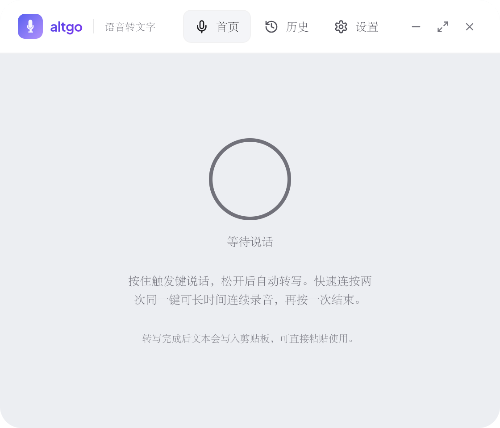
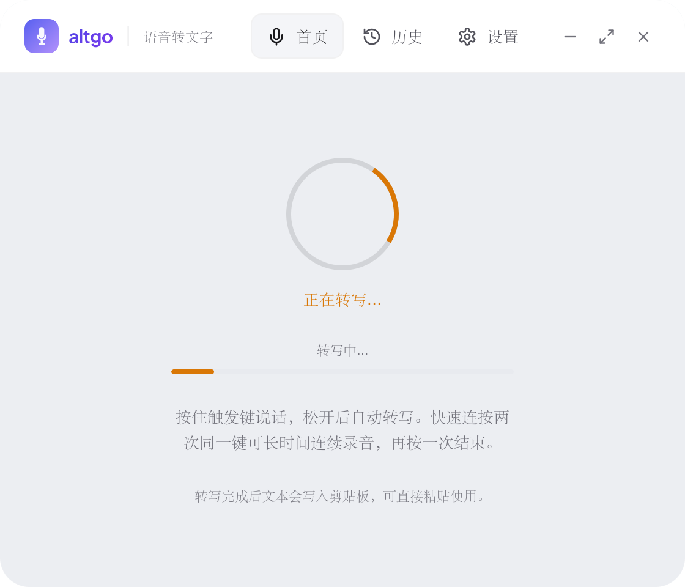
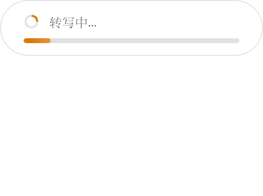
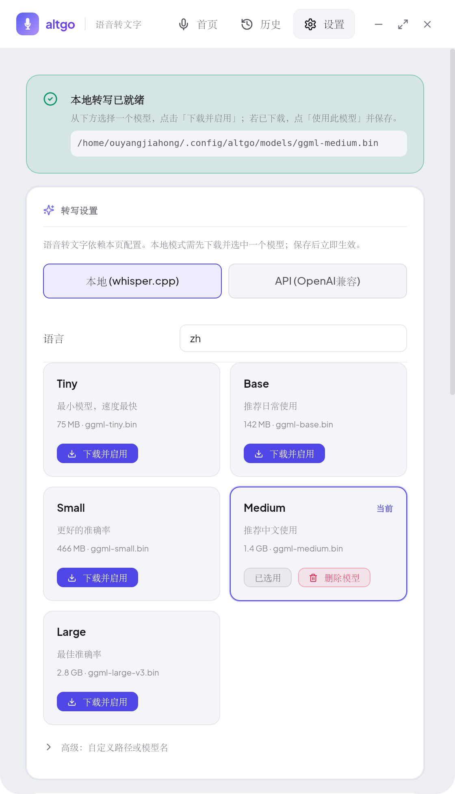
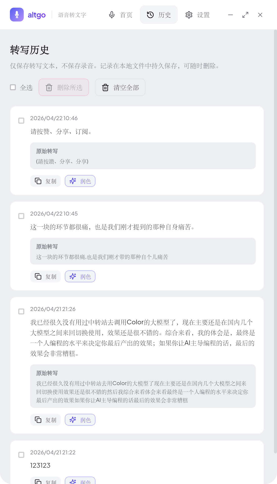

# altgo

**无需打字，言出法随** — Linux 语音转文字桌面工具

按住右 Alt 键说话，松开后在本地用 **whisper.cpp** 转写，可选通过 **OpenAI 兼容 API 或 Anthropic Messages API** 调用 LLM 润色；成功后**会尝试将结果写入系统剪贴板**，并在**悬浮窗**中展示，便于核对；也可在悬浮窗内再次点击复制（例如剪贴板工具不可用或需二次确认时）。所有转写文本（原始 + 润色后）会自动保存到本地**历史记录**，随时可查、可复制、可再次润色。

**在线文档**：[https://cislunarspace.github.io/altgo/](https://cislunarspace.github.io/altgo/)（与 [`docs-site/`](docs-site/) 同源，由 GitHub Pages 部署）。

本仓库**仅支持 Linux**（Ubuntu 20.04+）。**不提供 Windows 或 macOS 构建或发布**（历史设计文档见 [`docs/superpowers/`](docs/superpowers/)）。







## 功能

- **长按触发**：长按右 Alt 键进入录音模式，松开自动停止并处理
- **双击切换**：双击右 Alt 键进入连续录音模式，再次单击停止
- **本地 ASR**：以 **whisper.cpp** 为主；`whisper-cli` 与 **ffmpeg** 等随 **官方预编译包** 一并提供，一般无需自行安装；模型可在**设置**里下载并选用
- **LLM 润色（可选）**：通过 **OpenAI 兼容 API** 或 **Anthropic Messages API** 调用任意厂商或本地部署的 LLM（如云端 API、Ollama、vLLM 等），对转写文本做 light / medium / heavy 等档位润色
- **悬浮窗与剪贴板**：处理完成后写入剪贴板并弹出悬浮窗；可在悬浮窗内再次复制
- **桌面通知**：处理完成时可伴随通知提示（依配置）
- **转写历史**：所有成功转写自动保存到本地 `history.json`；支持在历史页面查看列表、删除单条、清空全部、复制内容，以及对任意历史记录**再次润色**

## 系统要求（Linux）

- **测试与部署环境**：目前仅在 **Ubuntu 20.04** 上做过安装与运行验证；其他发行版可能可用，但未保证。
- **读取键盘设备（必做）**：在常见安装方式下，必须将当前用户加入 **`input` 组**，否则无法稳定访问 `/dev/input/event*`，按键监听会失败。执行后**须重新登录**会话方可生效：

  ```bash
  sudo usermod -aG input "$USER"
  # 注销并重新登录，或重启后再试
  ```

- **其余系统组件**（如与桌面、音频、通知相关的库）由 **`.deb` 的依赖关系** 或发行说明处理：缺什么按安装器提示补装即可，不必手工对照长清单。

## 系统托盘

启动后会在系统托盘显示图标，点击图标可显示/隐藏主窗口，右键菜单提供「显示窗口」和「退出」选项。

## 安装

### 给最终用户（推荐）

#### Linux（主要平台）

1. 前往 [Releases](../../releases) 下载 **`.deb`** 或 **AppImage**。
2. 安装 **`.deb`**（Ubuntu / Debian 系）：
   - **推荐**用 `apt` 从本地文件安装，这样会**自动安装** deb 的 `Depends` 里声明的系统包（如 GTK / WebKit、系统托盘、剪贴板工具、录音与通知相关组件等）：

     ```bash
     sudo apt install /path/to/altgo_*_amd64.deb
     ```

     将路径换成你保存 deb 的**实际位置**（例如 `~/Downloads/altgo_2.2.2_amd64.deb`）；在 deb 所在目录时也可写 `sudo apt install ./altgo_*.deb`。
   - **不建议只用** `sudo dpkg -i …`：dpkg 不会拉取依赖。若本机缺少任一依赖，常见报错为 *dependency problems – leaving unconfigured*，**软件包会处于未配置（unconfigured）状态**，主程序可能仍不可用或包管理器会提示有未完成配置。
   - **已经用 dpkg 装到一半失败时**：
     - 执行 `sudo apt install -f`（或同义的 `sudo apt -f install`），让 apt **补全依赖**并完成 `altgo` 的配置；或
     - 先按错误信息用 `sudo apt install 缺失包名` 装齐，再执行 `sudo dpkg --configure -a`。
   - 若需卸掉后重装：`sudo dpkg --remove altgo`（必要时加 `--force-remove-reinstreq`），再按上文的 **`apt install ./…deb`** 重装。
   - **AppImage**：下载后赋予执行权限即可运行，无需安装：

     ```bash
     chmod +x /path/to/altgo-*.AppImage
     /path/to/altgo-*.AppImage
     ```

3. **务必**完成 [系统要求](#系统要求linux) 中的 **`input` 组** 步骤（与按键监听相关，安装包无法代劳）。
4. 启动应用，在 **[设置](#首次使用应用内设置)** 里完成转写模型与可选润色等；**不要**一上来编辑配置文件。

**预编译包与捆绑内容**：官方构建会把 **ffmpeg**、**whisper-cli** 等与程序一起打进 **deb / AppImage**，目标是 **安装后开箱即用**，无需再为录音与转写去单独安装这些二进制。

### 给开发者（从本仓库构建）

克隆仓库后，使用 **`make build`** 可一次性拉取 **whisper-cli、ffmpeg** 等到 `target/deps/bin/`，执行 `cargo tauri build`，并把依赖二进制拷贝到 `src-tauri/target/release/bin/`，与 CI/打包流程一致。**日常联调与验证同样建议以 `make build` 为主**，确保与发布产物行为一致。

```bash
git clone <本仓库 URL>
cd altgo
cd frontend && npm install && cd ..
# Linux：先安装 Tauri 所需的 GTK/WebKit 等开发包，见下文「开发环境」
make deps-linux
make build
# 可选：sudo make install
```

若需快速改前端界面，可临时使用 `cargo tauri dev` 获得热重载；**完整链路（含捆绑二进制、与发布一致）仍以 `make build` 为准。**

从源码自行构建且**未**走 `make deps-linux` 时，才需要自行保证 **ffmpeg** / **whisper-cli** 可被程序找到（例如加入 `PATH`）。

## 首次使用：应用内设置

安装并启动后，**面向用户的选项都应在图形界面里完成**，无需先理解配置文件：

- **顶部状态**：会提示本地转写是否就绪（例如是否已选用可用模型）；按提示操作即可。
- **转写**：选择 **本地 whisper.cpp** 或 **云端 API**（若使用）；设置识别语言；在 **模型管理** 中 **下载 / 选用** 模型，或使用「高级」填写本机 `.bin` 路径或模型名。
- **润色**：选择是否启用以及轻/中/重度；选择 API 协议（OpenAI 兼容 或 Anthropic）；填写地址、模型名与密钥（适用于云端或本地网关如 Ollama 等）。
- **外观**：浅色 / 深色 / 跟随系统；**界面语言**。
- **录音 / 触发键**：预设左右 Alt 或 **「按下以设置」** 捕获快捷键。
- **输出**：开关桌面通知、剪贴板行为等。
- 点击 **保存**；多数情况下管道会自动重载，无需重启应用。

跟着界面走即可完成日常使用。



## 高级：直接编辑配置文件（可选）

仅在需要 **脚本化、批量部署、或与 GUI 未暴露的字段打交道** 时使用：

- **配置路径**：`~/.config/altgo/altgo.toml`

仓库内 [`configs/altgo.toml`](configs/altgo.toml) 列出全部字段及注释；与界面保存的是同一套配置。

### 环境变量（高级 / 部署）

| 变量 | 说明 |
| ---- | ---- |
| `ALTGO_POLISHER_API_KEY` | 覆盖润色 API 密钥 |
| `ALTGO_TRANSCRIBER_API_KEY` | 若使用云端转写 API，可覆盖其密钥 |
| `RUST_LOG` | 日志级别，如 `altgo=debug` |

## 使用

1. 启动 altgo。
2. **长按右 Alt** → 录音 → 松开 → 本地转写（及可选润色）→ **悬浮窗**展示结果，并自动写入剪贴板。
3. **双击右 Alt** → 连续录音 → 再次单击停止 → 同上。
4. 点击主窗口的**历史记录**标签，可浏览过往转写、复制内容或对单条记录再次润色。

### 按 Alt 没有反应？

1. **默认触发键是右侧 Alt**。优先在 **设置 → 录音 / 触发键** 里用「按下以设置」或预设；一般不必改配置文件。
2. **Linux：是否已加入 `input` 组并重新登录？** 未满足则 Wayland/X11 下按键设备常无法读取。
3. 查看主窗口是否报错：模型缺失、`xinput`/`evtest` 不可用等会导致管道无法就绪。
4. 调试：`RUST_LOG=altgo=debug altgo`。

### 历史记录查询

所有成功转写结果都会自动保存到本地历史。在历史页面你可以：
- 浏览全部转写记录（显示原始文本与润色后文本）
- 复制单条记录的原始或润色文本
- 对任意历史记录**再次润色**
- 删除单条或清空全部历史

> **隐私说明**：历史记录仅保存**文本**，不会存储任何音频文件。



## 架构

```text
按键事件 → 状态机 → 录音 → whisper.cpp 转写 → 可选 LLM 润色 → 悬浮窗展示 + 剪贴板 + 通知 + 历史记录持久化
```

altgo 基于 **Tauri**，前端 **React**，核心逻辑 **Rust**。关键模块包括：

| 模块 | 职责 |
|------|------|
| `state_machine` | 按键状态管理（单击 / 长按 / 双击 / 连续录音） |
| `recorder` | 音频采集（`parecord`） |
| `transcriber` | 本地 `whisper-cli` 或 OpenAI 兼容 API 转写 |
| `polisher` | OpenAI 兼容 API 或 Anthropic Messages API 润色 |
| `output` | 剪贴板写入、桌面通知 |
| `history` | 本地 `history.json` 的追加 / 列表 / 删除 / 更新 |
| `model` | GGML 模型下载与管理 |

## 开发环境

### 前置依赖

- Rust stable（建议 **1.80+**，见 [Tauri 2 前置条件](https://tauri.app/start/prerequisites/)）
- **Node.js 18+**（建议 20+）
- Tauri CLI：`cargo install tauri-cli --version "^2"`

### Ubuntu 20.04 上打包依赖示例

```bash
sudo apt update
sudo apt install build-essential curl wget file \
  libwebkit2gtk-4.1-dev libgtk-3-dev libayatana-appindicator3-dev librsvg2-dev
```

仅需可执行文件、不生成 deb 时：`cargo tauri build --no-bundle`。

### 常用命令

```bash
cd frontend && npm install
make deps-linux && make build     # 推荐：与发布一致

cargo fmt --manifest-path=src-tauri/Cargo.toml -- --check
cargo clippy --manifest-path=src-tauri/Cargo.toml -- -D warnings
cargo test --manifest-path=src-tauri/Cargo.toml
cd frontend && npm run build
```

### Makefile 摘要

| 目标 | 说明 |
| ---- | ---- |
| `make deps-linux` | 下载 whisper-cli、ffmpeg 等至 `target/deps/bin/` |
| `make build` | 依赖上述二进制后 `cargo tauri build`，并拷贝到 `src-tauri/target/release/bin/` |
| `make install` | 安装可执行文件与 `/etc/altgo` 配置（通常需 `sudo`） |
| `make run` | 构建后直接运行 |
| `make test` / `make fmt` / `make lint` | 测试、格式化、Clippy 检查 |

## 相关文档

- **用户向站点**：[https://cislunarspace.github.io/altgo/](https://cislunarspace.github.io/altgo/) · 源码 [`docs-site/`](docs-site/)
- [CONTRIBUTING.md](CONTRIBUTING.md)（含 **CI / Release / GitHub Pages** 维护说明）
- [CLAUDE.md](CLAUDE.md)（面向 AI/贡献者的架构速览）
- [docs/](docs/)（维护者用的设计与计划归档，见 [`docs/README.md`](docs/README.md)）

## 许可证

[MIT](LICENSE)
