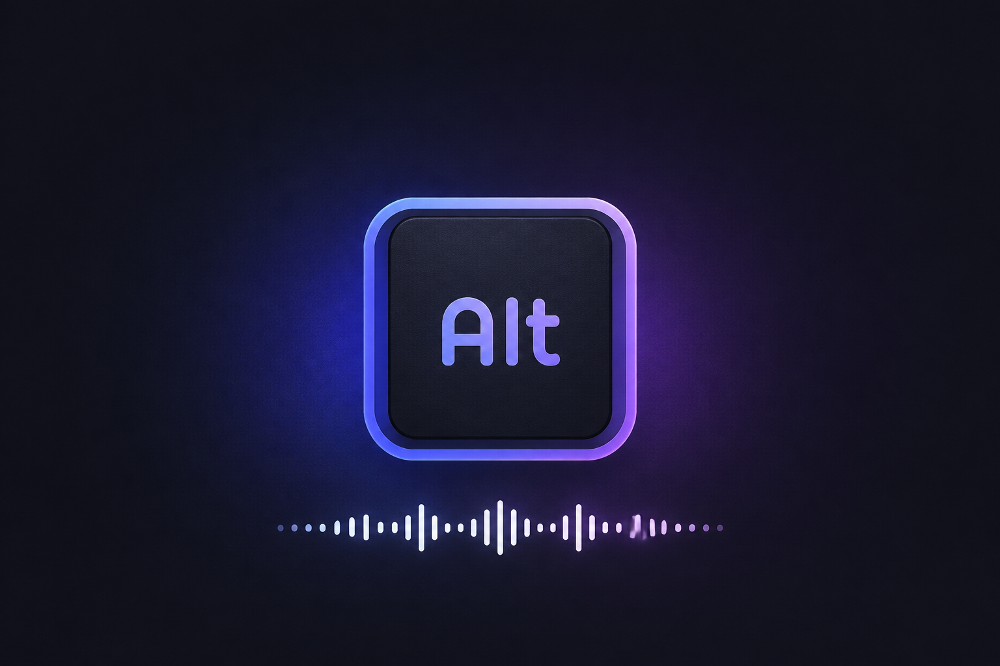

# altgo



[](https://github.com/cislunarspace/altgo/actions/workflows/ci.yml)
[](https://cislunarspace.github.io/altgo/)
[](https://github.com/cislunarspace/altgo/releases)
[](LICENSE)

**altgo** 是一款桌面语音转文字工具。按住触发键说话，松开后自动完成录音、转写和可选润色，结果写入系统剪贴板并显示在悬浮窗中。

支持 **Linux**（Ubuntu 22.04+）的 **x86_64** 与 **aarch64** 架构，以及 **Windows 10+**（x86_64）。目前不支持 macOS。

- [在线文档](https://cislunarspace.github.io/altgo/)
- [下载 Releases](https://github.com/cislunarspace/altgo/releases)
- [报告问题](https://github.com/cislunarspace/altgo/issues)

## 功能

- 长按右 Alt 录音，松开后自动转写
- 双击右 Alt 进入连续录音，再次单击停止
- 本地 SenseVoice 转写（内嵌 sherpa-onnx），模型只加载一次、响应快，可在设置页下载和管理
- 支持 OpenAI 兼容 API 与 Anthropic Messages API 的 LLM 润色
- 结果写入剪贴板，并在悬浮窗展示，可再次复制
- 托盘常驻，可隐藏主窗口或退出应用
- 保存本地转写历史，可查看、复制、删除、清空和再次润色
- 只保存文本，不保存音频

## 安装

### Linux

安装前先将当前用户加入 `input` 组，否则无法读取键盘设备。执行后需要重新登录：

```bash
sudo usermod -aG input "$USER"
```

然后：

1. 从 [Releases](https://github.com/cislunarspace/altgo/releases) 下载对应安装包：`.deb`、`.rpm` 或 `.AppImage`。
2. 安装下载的包，例如：

   ```bash
   sudo apt install ./altgo_*.deb
   # 或
   sudo dnf install ./altgo-*.rpm
   ```

   `.AppImage` 免安装，下载后赋予执行权限直接运行：

   ```bash
   chmod +x altgo_*.AppImage && ./altgo_*.AppImage
   ```

   AppImage 不像 deb/rpm 那样自动装依赖，缺库时参考下一段依赖清单自行安装。

3. 重新登录后启动 altgo，在设置页完成转写配置。

`.deb` 和 `.rpm` 会声明桌面、音频、剪贴板、通知和 `evtest` 等依赖；若使用 Wayland，请确认系统已安装 `evtest` 且当前用户能读取 `/dev/input/event*`。

### Windows

从 [Releases](https://github.com/cislunarspace/altgo/releases) 下载安装包：

- `*-setup.exe`（NSIS 安装器）：双击安装，适合大多数用户。
- `*.msi`：适合需要 MSI 部署方式的企业环境。

仅支持 Windows x64（内嵌的 sherpa-onnx 预编译库暂无 Windows arm64 版本）。安装后在开始菜单启动 altgo，在设置页完成转写配置。

## 快速开始

启动应用后，在 **设置** 页完成以下配置：

1. 下载并选择本地 SenseVoice 模型。
2. 按需设置润色级别和润色服务。
3. 确认触发键，默认是右 Alt。
4. 点击保存。

默认使用长按模式：

```text
按下右 Alt → 开始录音 → 松开右 Alt → 转写 → 润色（可选）→ 剪贴板 + 悬浮窗
```

较长的发言可以双击右 Alt 进入连续录音，再单击一次停止：

```text
双击右 Alt → 连续录音 → 单击右 Alt → 转写 → 润色（可选）→ 剪贴板 + 悬浮窗
```

历史记录默认保存在：

```text
~/.config/altgo/history.json
```

## 相关文档

- [在线文档](https://cislunarspace.github.io/altgo/)：快速开始、使用说明与架构
- [配置指南](https://cislunarspace.github.io/altgo/docs/configuration)：配置文件字段、环境变量与日志级别
- [常见问题](https://cislunarspace.github.io/altgo/docs/faq)：按键、录音、转写、润色与剪贴板排障
- [`CONTRIBUTING.md`](CONTRIBUTING.md)：开发环境、构建、测试、CI、Release 与文档站部署
- [`docs/architecture.md`](docs/architecture.md) 与 [`AGENTS.md`](AGENTS.md)：系统架构与核心模块说明
- [`docs/README.md`](docs/README.md)：设计与计划类文档索引
- [`CHANGELOG.md`](CHANGELOG.md)：版本变更记录

## 许可证

[MIT License](LICENSE)
